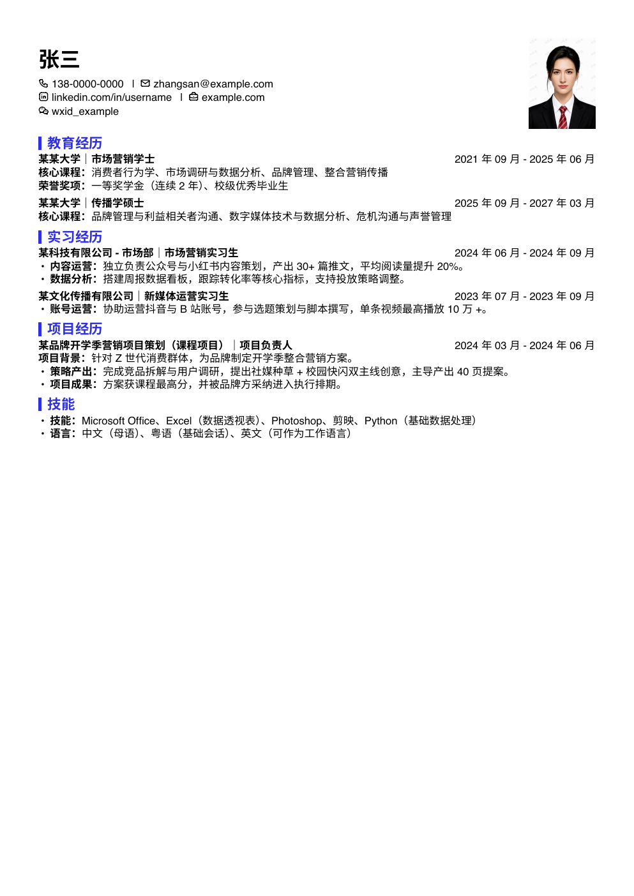
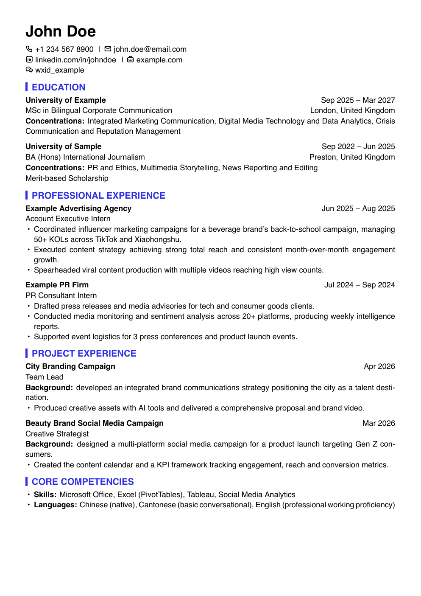
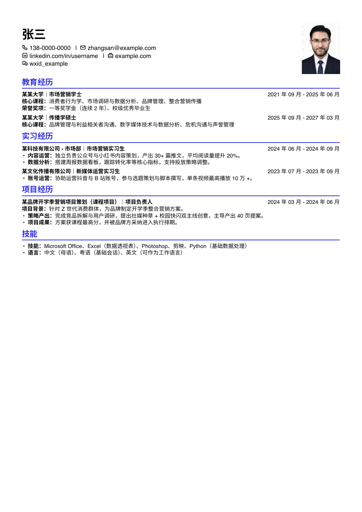
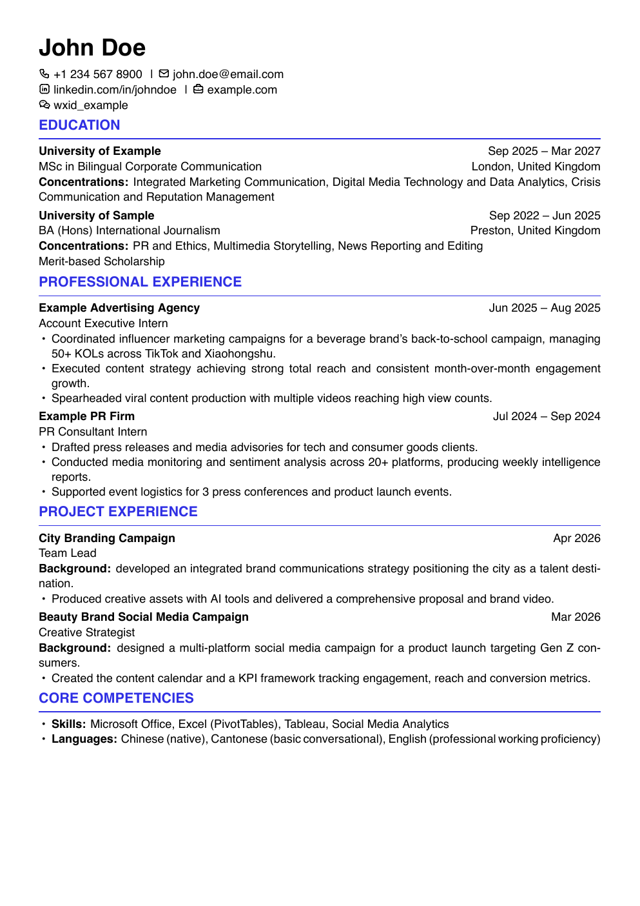

# Latex CV by Icarus

[English](README.md) | [简体中文](README.zh-CN.md) | 繁體中文

預製 LaTeX 履歷模板與 Agent 驅動工作流，用於把原始履歷內容打磨成結構清晰、版式穩定、可直接投遞的 PDF 履歷。

`Latex CV by Icarus` 是一套把可重複使用的 LaTeX 模板與 Agent 工作流結合起來的履歷生產 Skill。它幫助使用者從原始或持續迭代中的履歷內容出發，透過結構化迭代、版式控制、校驗流程與交付規範，產出更成熟的職缺投遞版本。

它不是單純的模板倉庫。模板負責定義視覺與排版標準，工作流負責推動內容優化、職缺匹配、頁數控制、編譯校驗與最終交付，讓履歷從「能看」走向「可投遞」。

## 預覽

下面是目前模板集的 PNG 渲染預覽。

  
  

  
  

## 它能做什麼

- 提供可重複使用的 LaTeX 履歷模板，用於中英文履歷生產
- 透過 Agent 工作流持續優化內容、結構與職缺匹配度
- 控制頁數、間距、層級與整體版式一致性
- 覆蓋從內容整理到最終 PDF 交付的完整流程
- 增加編譯與校驗步驟，確保輸出不只好看，也真正可用

## 為什麼做它

很多履歷工具只解決「寫內容」或「套模板」其中一半的問題。`Latex CV by Icarus` 想把這兩件事結合起來，用可重複使用的模板保證呈現品質，用 Agent 工作流推動持續迭代，讓最終結果更接近真實求職情境中的交付標準。

## 工作流

1. 從 Markdown 履歷內容出發，將其作為唯一內容來源
2. 選擇合適的中英模板與目標版式
3. 將內容映射到 LaTeX 結構，而不是任意改寫事實
4. 借助 Agent 持續迭代，直到履歷滿足職缺與頁數要求
5. 編譯、校驗並交付最終 PDF

## 倉庫結構

- `SKILL.md`：Skill 定義、約束條件、工作流與操作規則
- `assets/templates/`：可重複使用的 LaTeX 模板、字體與示例資源
- `assets/previews/`：模板對應的 PDF 與 PNG 預覽
- `references/`：命名規範、調參規則與校驗說明
- `agents/openai.yaml`：Agent 整合所需的展示中繼資料

## 說明

- Markdown 是唯一內容來源，LaTeX 負責版式與渲染
- 倉庫內模板均為脫敏後的可重複使用生產資源
- 整體工作流強調版式紀律、校驗流程與最終交付品質
